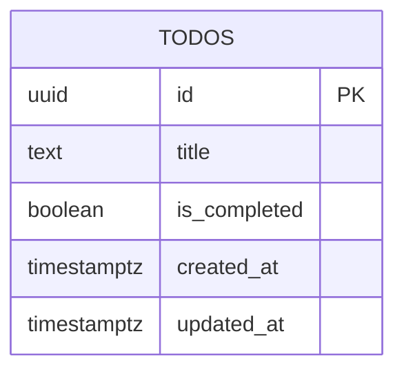

# Database Design (ERD) — Todo App

Engine: PostgreSQL 16
Last updated: 2026-08-13
Source requirements: `docs/todos/SRS.md`

## 1. Overview

This schema stores saved todo tasks for one personal list with no authentication, no account ownership, and no sharing. `todos` is the only aggregate root because each task has independent identity, lifecycle, completion state, and timestamps. User accounts, tags, due dates, priorities, search metadata, audit history, and soft-delete records are deliberately out of scope.

## 2. Diagram

Relationships: none. SRS explicitly excludes authentication, user accounts, tags, sharing, and collaboration, so no other entity owns or relates to todos.

## 3. Entities

### 3.1 `todos`

**Purpose** — Stores one saved task visible in the personal todo list. **Traces to** — TODOS-001, TODOS-002, TODOS-003, TODOS-004.

| Column | Type | Null | Default | Unique | Description |
|---|---|---|---|---|---|
| `id` | `uuid` | no | `gen_random_uuid()` | PK | Stable task identifier used to update or delete correct task. |
| `title` | `text` | no | none | no | Trimmed task title shown exactly as saved; duplicate titles allowed. |
| `is_completed` | `boolean` | no | `false` | no | Completion state; new tasks start incomplete. |
| `created_at` | `timestamptz` | no | `now()` | no | Creation time used for newest-first ordering. |
| `updated_at` | `timestamptz` | no | `now()` | no | Last update time; changes when completion state changes. |

**Nullable columns** — none.

**Foreign keys**

| Column | References | On delete | On update | Why |
|---|---|---|---|---|
| none | none | none | none | No parent table exists in approved scope. |

**Constraints**

- `ck_todos_title_length`: `CHECK (char_length(title) BETWEEN 1 AND 120)` enforces TODOS-001 title boundary after application trim.
- `ck_todos_title_trimmed`: `CHECK (title = btrim(title))` prevents untrimmed persisted titles and protects list display consistency.

**Indexes**

| Name | Columns | Type | Query it serves |
|---|---|---|---|
| `idx_todos_created_at_id` | `created_at DESC, id DESC` | btree | List saved tasks newest first for TODOS-002. `id` gives stable tie-break order when timestamps match. |

**Lifecycle** — hard delete. TODOS-004 requires deleted tasks disappear from persistence and stay gone; no audit, reports, billing, undo, or retention requirement exists.

**Story extension — Persist and list tasks** — Existing `todos` columns fully satisfy reviewed UI mock `TodoTask` shape: `id`, `title`, `is_completed`, `created_at`, and `updated_at`. No new table, column, nullable field, foreign key, or index is needed for TODOS-002.

## 4. Enumerations

No enumerations. Completion is a boolean because SRS has exactly two states: complete and incomplete.

| Name | Values | Mechanism | Why |
|---|---|---|---|
| none | none | none | No fixed multi-value domain exists in scope. |

## 5. Access patterns

| # | Pattern | Frequency | Index used |
|---|---|---|---|
| 1 | `SELECT id, title, is_completed, created_at, updated_at FROM todos ORDER BY created_at DESC, id DESC LIMIT 100` | Every page load, retry after load failure, reload after not-found/conflict handling | `idx_todos_created_at_id` |
| 2 | `INSERT INTO todos (title) VALUES ($1) RETURNING id, title, is_completed, created_at, updated_at` | Per add action | Primary key only for returned row; no title index because duplicate titles are allowed and no title lookup exists. |
| 3 | `UPDATE todos SET is_completed = $1, updated_at = now() WHERE id = $2 RETURNING id, title, is_completed, created_at, updated_at` | Per toggle action | Primary key index. |
| 4 | `DELETE FROM todos WHERE id = $1` | Per delete action | Primary key index. |

## 6. Data volume and growth

| Table | Rows at launch | Growth | Retention |
|---|---|---|---|
| `todos` | 0 | Small personal list; expected under 100 rows for current requirement | Until visitor deletes task; hard-deleted immediately on delete action |

No table is expected to exceed 10M rows within a year. Pagination, partitioning, archival, and search indexes are skipped until requirements exceed the 100-task list boundary.

## 7. Integrity, privacy, and security

- Database enforces stable primary keys, required title, title length, trimmed title, required completion state, and required timestamps. Application still trims input and returns user-friendly validation errors because boundary validation happens at API edge too.
- Application enforces rapid-submit, repeated-toggle, repeated-delete, and optimistic rollback behavior because those are interaction rules, not database invariants.
- Stored personal data is limited to `todos.title`; retention is hard delete when visitor deletes task.
- No secrets are stored.
- No row-level access rule exists because no sign-in, users, roles, or per-account task lists exist in scope. If auth is added later, schema must add ownership requirements before implementation.

## 8. Migrations

| # | Change | Forward | Backward | Safe on non-empty table |
|---|---|---|---|---|
| 1 | Enable UUID generation | `CREATE EXTENSION IF NOT EXISTS pgcrypto;` in `000001_init.up.sql` | No extension drop in down migration; extension may be shared by other objects | Safe. Idempotent extension creation; down intentionally leaves extension installed to avoid breaking shared dependency. |
| 2 | Initial `todos` table | `CREATE TABLE todos (...)` with primary key, defaults, `NOT NULL`, and checks in `000001_init.up.sql` | `DROP TABLE IF EXISTS todos;` in `000001_init.down.sql` | Safe on empty database. On populated database, backward migration is destructive and must only run in rollback/test environments. |
| 3 | Newest-first list index | `CREATE INDEX idx_todos_created_at_id ON todos (created_at DESC, id DESC);` in `000001_init.up.sql` | Dropped with table in `000001_init.down.sql` | Safe at launch. If added later to populated production table, use `CREATE INDEX CONCURRENTLY`. |
| 4 | Persist/list story design | No schema migration beyond steps 1–3; TODOS-002 uses existing `todos` table and list index. | No rollback action. | Safe on populated table because no DDL or data change is introduced. |

Initial migration creates new objects only, so forward path is safe on an empty or populated database with no conflicting `todos` table. Backward path deletes todo data; acceptable only before production data or in explicit rollback with data loss accepted.

## 9. Open questions

| Question | Owner | Blocking |
|---|---|---|
| none | none | no |
