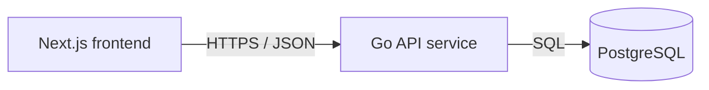

# Service & Interface Design — Todo App

Last updated: 2026-08-13
Source: `docs/todos/SRS.md`, `docs/architecture/erd.md`, `docs/architecture/overview.md`

## 1. Service map



| Service | Responsibility | Owns (tables) | Depends on | Deploy unit |
|---|---|---|---|---|
| Go API service | Validate todo requests, enforce todo contract, persist tasks, expose health and todo endpoints. | `todos` | PostgreSQL | `code/backend` container |
| Next.js frontend | Render one accessible todo page and call Go API over JSON. | none | Go API service | `code/frontend` container |
| PostgreSQL | Durable storage for todo rows. | physical database only; logical owner is Go API service | none | database container or managed PostgreSQL |

**Why these boundaries** — single backend service: no boundary justified yet. Todo App has one owner, one deploy cadence, one data aggregate, no external integrations, and no independently scaling service.

## 2. Cross-cutting contract

### 2.1 Base

- Base URL: `{scheme}://{host}/api/v1`
- Content type: `application/json; charset=utf-8`
- Versioning: URL path major version. A new major version only for breaking changes.
- Trace header: `X-Request-Id` accepted from caller, generated if absent, echoed on every response and present in every log line.
- JSON naming: `snake_case`.
- IDs: strings on wire. Todo IDs are UUID strings.
- Timestamps: RFC 3339 UTC strings with `_at` suffix.
- Request body cap: 16 KiB for todo write endpoints.

### 2.2 Authentication and authorization

| Aspect | Decision |
|---|---|
| Mechanism | none |
| Token lifetime | not applicable |
| Refresh | not applicable |
| Transport | no `Authorization` header required or used |
| Roles | `visitor` only |
| Enforcement point | per-handler permits visitor actions; no identity-derived filters exist |

No sign-in exists in scope. If authentication is added later, task ownership and permissions are breaking contract and schema changes.

### 2.3 Error contract

Every non-2xx response, from every endpoint, has this shape:

```json
{
  "error": {
    "code": "VALIDATION_FAILED",
    "message": "Human-readable summary, safe to show a user.",
    "details": [
      { "field": "title", "code": "TOO_LONG", "message": "Title must be 120 characters or fewer." }
    ],
    "request_id": "01HX0000000000000000000000"
  }
}
```

Consumers branch on `code`. `message` and `details[].message` are display text and may be reworded at any time without notice.

**Error catalog** — closed set for this project.

| Code | HTTP | Meaning | Retryable |
|---|---|---|---|
| `BAD_REQUEST` | 400 | Malformed JSON, wrong JSON type, unsupported content type, or invalid query/path syntax. | no |
| `VALIDATION_FAILED` | 422 | Request body or query is well-formed but violates documented constraints. | no |
| `NOT_FOUND` | 404 | Todo does not exist. | no |
| `RATE_LIMITED` | 429 | Too many requests; honor `Retry-After`. | yes |
| `INTERNAL` | 500 | Unexpected failure; details are logged, not returned. | yes |
| `UNAVAILABLE` | 503 | Database unavailable or server shutting down. | yes |

No `UNAUTHENTICATED`, `PERMISSION_DENIED`, or `CONFLICT` responses exist while no auth, roles, ownership, or state conflict rule exists.

### 2.4 Pagination

Current SRS requires showing up to 100 saved tasks and has no paging controls. Todo list endpoint returns all current tasks, capped at 100 rows, newest first.

| Aspect | Decision |
|---|---|
| Style | none for v1 todo list; cursor pagination deferred |
| Default limit | 100 |
| Max limit | 100 |
| Default sort | `created_at DESC, id DESC`; stable and unique |

Collection response still uses object shape so pagination can be added later without breaking:

```json
{
  "tasks": [],
  "next_cursor": null,
  "has_more": false
}
```

`next_cursor` is always `null` and `has_more` is always `false` in v1.

### 2.5 Validation boundary

Validation boundary is Go API HTTP handler layer after JSON decode and before service/database calls. It validates content type, body size, JSON types, path UUID format, title trim and length, and `is_completed` type. Downstream application and database code may trust validated inputs; database constraints still protect integrity.

Frontend also validates for immediate accessible feedback, but API validation is authoritative.

### 2.6 Idempotency

- `POST /api/v1/todos` does not accept `Idempotency-Key`; duplicate titles are valid and rapid repeat submit prevention belongs to frontend pending state.
- `PATCH /api/v1/todos/{todo_id}` does not accept `Idempotency-Key`; request sets explicit `is_completed`, so replay returns same persisted state unless row is gone.
- `DELETE /api/v1/todos/{todo_id}` is HTTP-idempotent; deleting an already missing todo returns `204 No Content` to support repeated delete controls and SRS not-found behavior.
- No idempotency key store exists in v1.

### 2.7 Reviewed mock contract for Persist and list tasks

UI PR #16 mock module `code/frontend/lib/mock/persist-and-list-tasks.ts` defines this wire shape:

```ts
export type TodoTask = {
  id: string;
  title: string;
  is_completed: boolean;
  created_at: string;
  updated_at: string;
};

export type TodoListResponse = {
  tasks: TodoTask[];
  next_cursor: string | null;
  has_more: boolean;
};
```

The API matches this shape exactly for `GET /api/v1/todos`. Error responses use existing project envelope. The UI mock narrows list error codes to `BAD_REQUEST`, `RATE_LIMITED`, `INTERNAL`, and `UNAVAILABLE`; service contract keeps same set for GET.

## 3. Endpoints

### 3.1 `GET /api/v1/todos`

**Purpose** — Load saved tasks newest first. **Traces to** — TODOS-002. **Auth** — visitor.

**Path / query parameters**

| Name | In | Type | Required | Constraints | Description |
|---|---|---|---|---|---|
| none | none | none | no | none | Endpoint has no filters, sorting controls, or pagination controls in v1. |

**Request body**

No request body. If a body is sent, server ignores it only when empty; malformed or non-empty body is `BAD_REQUEST`.

**Success response** — `200`

```json
{
  "tasks": [
    {
      "id": "550e8400-e29b-41d4-a716-446655440000",
      "title": "Buy milk",
      "is_completed": false,
      "created_at": "2026-08-13T10:00:00Z",
      "updated_at": "2026-08-13T10:00:00Z"
    }
  ],
  "next_cursor": null,
  "has_more": false
}
```

| Field | Type | Nullable | Description |
|---|---|---|---|
| `tasks` | array of todo objects | no | Saved todos ordered by `created_at DESC, id DESC`; maximum 100. |
| `tasks[].id` | string | no | Todo UUID. |
| `tasks[].title` | string | no | Trimmed title, 1–120 characters. |
| `tasks[].is_completed` | boolean | no | `true` when complete, `false` when incomplete. |
| `tasks[].created_at` | string | no | Creation timestamp, RFC 3339 UTC. |
| `tasks[].updated_at` | string | no | Last update timestamp, RFC 3339 UTC. |
| `next_cursor` | string | yes | Always `null` in v1. |
| `has_more` | boolean | no | Always `false` in v1. |

**Errors** — every code this endpoint can return. No others.

| Code | HTTP | Trigger |
|---|---|---|
| `BAD_REQUEST` | 400 | Non-empty malformed request body or unsupported `Content-Type` with body. |
| `RATE_LIMITED` | 429 | Caller exceeds rate limit. |
| `INTERNAL` | 500 | Unexpected server error or persisted row violates required API shape while mapping. |
| `UNAVAILABLE` | 503 | Database unavailable, migration not ready, or server shutting down. |

**Notes** — no side effects. Timeout: API aborts database query after 2 seconds. No retries inside API for database query; caller may retry via UI retry action after failure. Query uses `SELECT id, title, is_completed, created_at, updated_at FROM todos ORDER BY created_at DESC, id DESC LIMIT 100`. If data integrity violation is detected while mapping rows, return `INTERNAL`; log row ID and request ID, not full list.

### 3.2 `POST /api/v1/todos`

**Purpose** — Create one incomplete todo from title. **Traces to** — TODOS-001. **Auth** — visitor.

**Path / query parameters**

| Name | In | Type | Required | Constraints | Description |
|---|---|---|---|---|---|
| none | none | none | no | none | Endpoint has no query parameters. |

**Request body**

```json
{
  "title": "Buy milk"
}
```

| Field | Type | Required | Constraints | Description |
|---|---|---|---|---|
| `title` | string | yes | Trimmed by API before validation; trimmed length 1–120 characters. | Todo title. Duplicate titles allowed. |

Unknown request fields are ignored for additive compatibility. `is_completed`, `created_at`, `updated_at`, and `id` are never accepted from client.

**Success response** — `201`

Headers:

```text
Location: /api/v1/todos/550e8400-e29b-41d4-a716-446655440000
```

```json
{
  "id": "550e8400-e29b-41d4-a716-446655440000",
  "title": "Buy milk",
  "is_completed": false,
  "created_at": "2026-08-13T10:00:00Z",
  "updated_at": "2026-08-13T10:00:00Z"
}
```

| Field | Type | Nullable | Description |
|---|---|---|---|
| `id` | string | no | Created todo UUID. |
| `title` | string | no | Trimmed saved title. |
| `is_completed` | boolean | no | Always `false` for new todos. |
| `created_at` | string | no | Creation timestamp, RFC 3339 UTC. |
| `updated_at` | string | no | Initial update timestamp, RFC 3339 UTC. |

**Errors** — every code this endpoint can return. No others.

| Code | HTTP | Trigger |
|---|---|---|
| `BAD_REQUEST` | 400 | Missing body, malformed JSON, wrong JSON type, body over 16 KiB, or unsupported `Content-Type`. |
| `VALIDATION_FAILED` | 422 | Missing `title`, non-string `title`, trimmed title empty, or trimmed title over 120 characters. |
| `RATE_LIMITED` | 429 | Caller exceeds rate limit. |
| `INTERNAL` | 500 | Unexpected server error. |
| `UNAVAILABLE` | 503 | Database unavailable or server shutting down. |

**Notes** — side effect: inserts one row into `todos`. Timeout: API aborts insert after 2 seconds. No server retry because retrying create without idempotency can duplicate valid duplicate titles. Frontend prevents duplicate pending submissions for same form action and keeps title available if save fails.

### 3.3 `PATCH /api/v1/todos/{todo_id}`

**Purpose** — Set completion state for one todo. **Traces to** — TODOS-003. **Auth** — visitor.

**Path / query parameters**

| Name | In | Type | Required | Constraints | Description |
|---|---|---|---|---|---|
| `todo_id` | path | string | yes | UUID format. | Todo to update. |

**Request body**

```json
{
  "is_completed": true
}
```

| Field | Type | Required | Constraints | Description |
|---|---|---|---|---|
| `is_completed` | boolean | yes | `true` or `false`; no coercion from string or number. | Desired completion state. |

Unknown request fields are ignored for additive compatibility. Omitted fields mean unchanged, but at least `is_completed` is required in v1.

**Success response** — `200`

```json
{
  "id": "550e8400-e29b-41d4-a716-446655440000",
  "title": "Buy milk",
  "is_completed": true,
  "created_at": "2026-08-13T10:00:00Z",
  "updated_at": "2026-08-13T10:01:00Z"
}
```

| Field | Type | Nullable | Description |
|---|---|---|---|
| `id` | string | no | Todo UUID. |
| `title` | string | no | Saved title. |
| `is_completed` | boolean | no | Persisted completion state after update. |
| `created_at` | string | no | Creation timestamp, RFC 3339 UTC. |
| `updated_at` | string | no | Timestamp changed by this update. |

**Errors** — every code this endpoint can return. No others.

| Code | HTTP | Trigger |
|---|---|---|
| `BAD_REQUEST` | 400 | Invalid UUID path, missing body, malformed JSON, wrong JSON type, body over 16 KiB, or unsupported `Content-Type`. |
| `VALIDATION_FAILED` | 422 | Missing `is_completed` or non-boolean `is_completed`. |
| `NOT_FOUND` | 404 | Todo ID does not exist. |
| `RATE_LIMITED` | 429 | Caller exceeds rate limit. |
| `INTERNAL` | 500 | Unexpected server error. |
| `UNAVAILABLE` | 503 | Database unavailable or server shutting down. |

**Notes** — side effect: updates `is_completed` and `updated_at`. Timeout: API aborts update after 2 seconds. No server retry; request is explicit-set and safe for frontend retry, but automatic retry is skipped to avoid fighting user repeated toggles. Frontend disables or serializes toggles while request is pending and rolls back visible state on failure.

### 3.4 `DELETE /api/v1/todos/{todo_id}`

**Purpose** — Hard-delete one todo. **Traces to** — TODOS-004. **Auth** — visitor.

**Path / query parameters**

| Name | In | Type | Required | Constraints | Description |
|---|---|---|---|---|---|
| `todo_id` | path | string | yes | UUID format. | Todo to delete. |

**Request body**

No request body. If a body is sent, server ignores it only when empty; malformed or non-empty body is `BAD_REQUEST`.

**Success response** — `204`

No response body.

| Field | Type | Nullable | Description |
|---|---|---|---|
| none | none | none | No body on success. |

**Errors** — every code this endpoint can return. No others.

| Code | HTTP | Trigger |
|---|---|---|
| `BAD_REQUEST` | 400 | Invalid UUID path, non-empty malformed request body, or unsupported `Content-Type` with body. |
| `RATE_LIMITED` | 429 | Caller exceeds rate limit. |
| `INTERNAL` | 500 | Unexpected server error. |
| `UNAVAILABLE` | 503 | Database unavailable or server shutting down. |

**Notes** — side effect: hard-deletes row if present. Missing row still returns `204` so repeated delete and stale UI remove task without blocking visitor. Timeout: API aborts delete after 2 seconds. `DELETE` is idempotent; frontend disables duplicate delete while pending and keeps task visible if delete fails.

### 3.5 `GET /healthz`

**Purpose** — Runtime health check for deployment and local compose. **Traces to** — architecture overview. **Auth** — none.

**Path / query parameters**

| Name | In | Type | Required | Constraints | Description |
|---|---|---|---|---|---|
| none | none | none | no | none | Endpoint has no parameters. |

**Request body**

No request body.

**Success response** — `200`

```json
{
  "ok": true
}
```

| Field | Type | Nullable | Description |
|---|---|---|---|
| `ok` | boolean | no | `true` only when migrations succeeded and database `SELECT 1` succeeds. |

**Errors** — every code this endpoint can return. No others.

| Code | HTTP | Trigger |
|---|---|---|
| `UNAVAILABLE` | 503 | Migrations failed, database ping failed, or server is shutting down. |

**Notes** — not under `/api/v1` because it is infrastructure, not product API. Timeout: database ping aborts after 1 second. No retry inside handler; orchestrator or container runtime repeats health checks.

## 4. Asynchronous work

No jobs, queues, schedules, or events exist in v1.

| Name | Trigger | Payload | Retry | Backoff | Dead letter | Idempotent |
|---|---|---|---|---|---|---|
| none | none | none | none | none | none | none |

## 5. External integrations

No third-party integrations exist. No secrets or provider setup required beyond `DATABASE_URL` runtime environment configured in architecture overview.

| System | Purpose | Protocol | Timeout | Retry | On failure | Secrets |
|---|---|---|---|---|---|---|
| PostgreSQL | Persist and load todo tasks. | SQL over database driver | 2 seconds per product query; 1 second health ping | No automatic retry inside request handlers | User sees load/save/toggle/delete error state and may retry in UI where offered; health endpoint returns 503 | `DATABASE_URL` |

## 6. Non-functional targets

| Aspect | Target |
|---|---|
| p95 latency (read) | API returns `GET /api/v1/todos` within 500 ms for 100 tasks under local DB latency; page-level SRS target remains 2 seconds. |
| p95 latency (write) | API returns add, toggle, and delete within 500 ms under local DB latency; UI shows pending feedback within 200 ms. |
| Availability | Single service best effort; health returns 503 when DB unavailable. |
| Rate limit | 60 requests per minute per source IP; `Retry-After` header on 429. |
| Payload cap | 16 KiB for JSON write bodies. |
| Timeout (inbound) | 5 seconds per HTTP request; DB operations use shorter per-query timeouts above. |

## 7. Observability

- Log fields on every request line: `request_id`, method, path, status, duration_ms, remote_addr, user_agent, error_code when present.
- Metrics per endpoint: request count, error count by code, duration histogram.
- Never log: full todo titles, full request bodies, secrets, database URLs, stack traces in client response, internal hostnames in client response.
- Internal logs may include todo ID and validation field names keyed by `request_id`.

## 8. Contract evolution

| Change | Additive or breaking | Migration path |
|---|---|---|
| Add optional response field to todo object | additive | Frontend must ignore unknown fields. |
| Add optional request field ignored by old clients | additive | Default must preserve current behavior. |
| Add pagination query parameters while default remains first 100 newest tasks with same response fields | additive | Keep `tasks`, `next_cursor`, and `has_more`; document cursor semantics. |
| Add auth, user ownership, or per-user filtering | breaking | New SRS, ERD migration adding ownership, new auth contract, and likely `/api/v2`. |
| Rename fields, change timestamp format, change title limit, or require confirmation/undo for delete | breaking | Announce replacement, migrate frontend, remove old shape only after replacement ships. |

## 9. Requirement traceability

| Requirement | Endpoint(s) |
|---|---|
| TODOS-001 — Add task by title | `POST /api/v1/todos` |
| TODOS-002 — Load and show saved tasks | `GET /api/v1/todos` |
| TODOS-003 — Mark task complete or incomplete | `PATCH /api/v1/todos/{todo_id}` |
| TODOS-004 — Delete saved task | `DELETE /api/v1/todos/{todo_id}` |

| Endpoint | Requirement(s) |
|---|---|
| `GET /api/v1/todos` | TODOS-002 |
| `POST /api/v1/todos` | TODOS-001 |
| `PATCH /api/v1/todos/{todo_id}` | TODOS-003 |
| `DELETE /api/v1/todos/{todo_id}` | TODOS-004 |
| `GET /healthz` | Architecture overview runtime contract |

## 10. Migration plan for Persist and list tasks

| Step | Forward | Backward | Safe on populated tables |
|---|---|---|---|
| 1 | Apply existing initial migration that creates `todos` and `idx_todos_created_at_id`. | Drop `todos` through existing down migration only in rollback/test environments. | Forward safe before product data. Backward destructive once tasks exist. |
| 2 | No extra DDL for TODOS-002. API reads existing columns and returns reviewed mock envelope. | No rollback action. | Safe on populated `todos`; read-only list endpoint changes no data. |

Backend story must replace any placeholder migration with the ERD-backed `todos` schema before enabling `GET /api/v1/todos`.

## 11. Open questions

| Question | Owner | Blocking |
|---|---|---|
| none | none | no |
